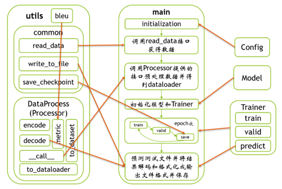

# CodeAnnotation
代码注释生成——基于CodeBERT和CodeT5预训练模型的fine-tune

## 代码框架

## 代码执行流程

由于本项目是在Colab上运行的，因此主训练文件——main.ipynb和代码注释文件annotation.ipynb是ipynb格式文件，**将代码放入Google Cloud Drive后需要将部分注释内容解注**，代码中有说明。

由于在本地测试代码时Hugging Face Datasets加载较慢且容易报错，因此本项目的数据集是下载来存储在data文件夹内的。

### 训练

本项目有CodeBERT/CodeT5两种模型类型可供训练选择，在Config.py中修改model_type即可切换到对应model，**打开main.ipynb，点击全部运行**即可按照默认配置进行训练/验证/测试（默认3个epoch，学习率5e-5，beam_size10...更多参见Config.py），运行期间最新的模型/ppl最低的模型/bleu最高的模型均会被保存在output/$model_type/文件夹中，方便进行生成任务。

### 代码注释生成

本项目的代码注释生成写在了另一个ipynb中——annotation.ipynb，里面有我本次项目的13个函数作为数据，用于生成注释，其中此ipynb默认使用了CodeT5模型，且需要从外界加载模型（本项目如果在Colab上运行代码中直接wget了官方二号检查点作为模型，需解注），其中可以调整generate时的参数来得到较好的结果。**同样全部运行即可**

## 参考链接

CodeBERT：https://github.com/microsoft/CodeBERT

CodeT5：https://github.com/salesforce/CodeT5

Dataset：https://github.com/microsoft/CodeXGLUE
